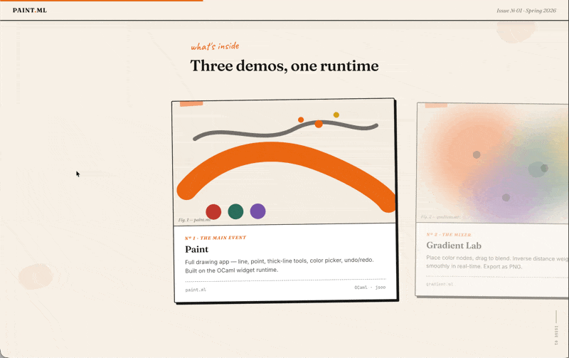
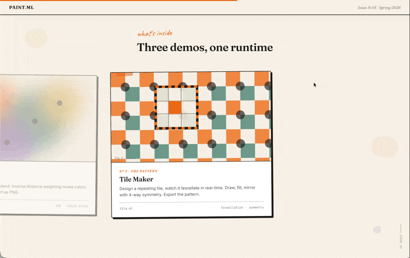

# PAINT.ML

**Live: [paintml.vercel.app](https://paintml.vercel.app)**

OCaml GUI framework compiled to the browser via js_of_ocaml. Ships as an editorial landing page showcasing three interactive demos — paint, gradient lab, and tile maker.






## Quick Start

```bash
make          # compile all .ml → .js
npm run dev   # serve at localhost:2202
```

## What It Does

A full widget system and event loop written in OCaml, targeting both native and browser via js_of_ocaml. The landing page (`index.html`) presents the demos as an art magazine spread with scroll-driven animations.

**Featured demos:**
- **paint.ml** — eight tools, 18-color palette, flood fill, eyedropper, undo/redo, PNG export
- **gradient.ml** — inverse distance weighting color blending, drag-to-place nodes
- **tile.ml** — pixel grid with symmetry modes, real-time tessellation preview

**OCaml-only demos (not featured on landing):**
- **lightbulb.ml** — minimal checkbox widget toggling a state
- **gdemo.ml** — graphics primitives (lines, rects, ellipses)
- **pairdemo.ml** — widget composition via pairing

## Tech Stack

| Layer | Tools |
|---|---|
| Language | OCaml |
| Browser compilation | js_of_ocaml |
| Frontend | Vanilla JS, HTML/CSS |
| Fonts | Fraunces, EB Garamond, JetBrains Mono, Caveat |

## Project Structure

```
index.html              landing page
style.css               editorial styles
main.js                 scroll animations
favicon.svg

demos/                  demo wrapper + live pages
  paint.html / paint-live.html
  gradient.html / gradient-live.html
  tile.html / tile-live.html
  gdemo.html / gdemo-live.html
  lightbulb.html / lightbulb-live.html
  pairdemo.html / pairdemo-live.html

assets/                 landing page GIFs

widget.ml/mli           core widget system
gctx.ml/mli             graphics context
paint.ml/mli            paint application
eventloop.ml/mli        event loop
deque.ml/mli            undo/redo queue
*.js                    js_of_ocaml compiled output
```

---

Built by Thomas Ou
